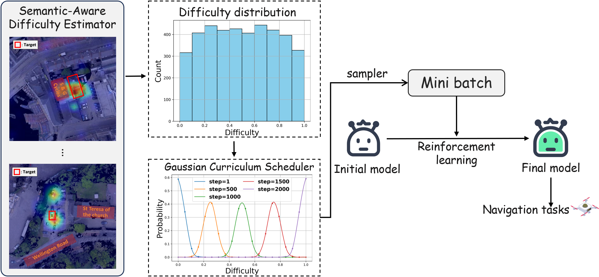

# 🚀 SA-GCS: Semantic-Aware Gaussian Curriculum Scheduling for UAV Vision-Language Navigation

This project explores a curriculum learning strategy for UAV navigation tasks by leveraging the attention scores from the final layer of a Vision-Language Model (VLM) decoder. By analyzing the attention distribution between textual queries and image regions, we estimate the difficulty of each sample based on whether the model is focusing correctly on the target. 

To further enhance training efficiency, we introduce a Gaussian-based difficulty-aware sampling strategy, which prioritizes samples of varying difficulty in a probabilistic manner. This approach significantly improves the performance of the navigation model on challenging scenarios.

## 🔍 Highlights
- 🔎 **Attention-based Difficulty Estimation**: Measures how well VLM attends to the target object.
- 📊 **Gaussian Sampling Strategy**: Selects training samples based on estimated difficulty for curriculum learning.
- 🚁 **Performance Boost**: Demonstrated improved accuracy and robustness in UAV navigation tasks.


## 🛠️ Environment Setup

This project depends on multiple models and tool libraries. It is recommended to use Conda to create an isolated environment.

### Install Conda Environment

```bash
conda create -n sagcs python=3.11
conda activate sagcs
```

```bash
pip install torch==2.6.0+cu124 torchvision==0.21.0+cu124 torchaudio==2.6.0+cu124 --index-url https://download.pytorch.org/whl/cu124
pip install -r requirements.txt

cd open-r1-multimodal
pip install -e .
```

---


## 🛠️ Model and Data Preparation

* Download model weights to `./model_weight/`  
  Note: Change the value of `max_pixels` in `preprocessor_config.json` to `16032016`.

* Download data to `./data/`


### 📦 Project Structure
├── model_weight/ # Directory for model weights (download manually)  
├── experiment/  
├── R1PhotoData/  
├── curriculum_learning/  
│    └── calculate_difficulty/ # Scripts and modules for computing sample difficulty scores  
│    └── gaussian_sampler/ # Dynamic sampling strategy based on Gaussian curriculum scheduling  
├── data/  
│    └── citynav/ # Data annotation directory  
│    └── rgbd-new/ # Raw image files  
│    └── training_data/ # Training data directory  
│    └── ...  
├── data_examples/ # Examples of some training data  
├── eval.py # Model inference and evaluation script  
├── open-r1-multimodal/ # GRPO training directory  
├── LLaMA-Factory/ # SFT training directory  
├── requirements.txt # Combined environment dependency file  
├── README.md # This document  
├── ...  

---

## 📈 Curriculum Learning

1. Calculate difficulty
Run the script to generate heatmaps and compute sample difficulty scores:

```bash
cd CGRL && python curriculum_learning/calculate_difiiculty/visual_attention_map.py
```
This script will:

- Load navigation data from data_example.json

- Run the model to extract cross-attention maps

- Compute target area masks

- Calculate difficulty scores

- Visualize heatmaps overlaid on the original image with target areas

- Save results to data_example_difficulty.json

2. Run the Gaussian curriculum sampling
Use the Gaussian curriculum sampler to resample training data based on difficulty:

```bash
cd CGRL && python curriculum_learning/gaussian_sampler/gaussian_sampler.py
```

This will:

- Load the annotated difficulty scores

- Perform dynamic sampling from easy to hard using a Gaussian distribution

- Save sampled data to gaussian_samples.json

3. Result Visualization

You can use the show_location function to visualize the heatmap overlay and the target polygon.
For debugging or analysis, all overlay images are saved to curriculum_learning/heatmap/.

## 🚀 Inference

1. Start the vLLM service
```bash
CUDA_VISIBLE_DEVICES=0,1,2,3 vllm serve path/to/your/model \
  --dtype auto \
  --trust-remote-code \
  --served-model-name qwen_2_5_vl_7b \
  --host 0.0.0.0 \
  -tp 4 \
  --uvicorn-log-level debug \
  --port your_port \
  --limit-mm-per-prompt image=2,video=0 \
  --max-model-len=32000
```

2. Start the inference script

```bash
python eval_by_qwen.py
```

3. Result Visualization  
You can use the visualize_prediction function to visualize the predicted target coordinates and the landmark bounding boxes, as well as the actual target coordinates and landmark bounding boxes.

---


## 🚀 Training
```bash
sh ./open-r1-multimodal/run_scripts/run_grpo_rec_lora.sh
```

---

## 📌 Reproducibility and Computational Settings
To ensure reproducibility:
We fix the random seed to 42 in all experiments to mitigate randomness in training and evaluation.
The experiments were conducted using the following computational infrastructure:
- GPU: 4 × NVIDIA A100 (80GB)
- CPU: Intel(R) Xeon(R) Platinum 8336C CPU @ 2.30GHz
- System: Linux (Ubuntu 20.04)
- Framework: PyTorch
- Dependencies: All relevant libraries and their versions are listed in requirements.txt
